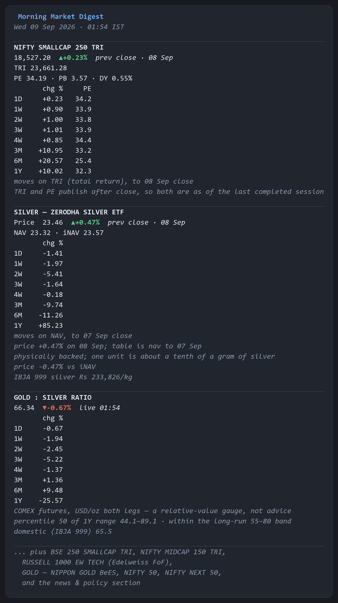

# nifty-market-digest-bot

Nifty 50, Nifty Next 50, Nifty Midcap 150 TRI, Nifty Smallcap 250 TRI, BSE 250 SmallCap TRI,
the Nippon Gold ETF, the Zerodha Silver ETF and the Russell 1000 Equal Weight Technology sleeve —
daily updates with PE, NAV/iNAV and historical comparisons, plus the gold:silver ratio, delivered
straight to Telegram.

Arrives at 11:11 IST on GitHub Actions. No server, no API keys, no paid data, nothing to
maintain on a normal week.

Every data source in this project was chosen by making the request and reading the response, not
from documentation. Where something the brief asked for turned out not to exist, it is listed as
a gap rather than approximated — see [Honest gaps](#honest-gaps).

---

## What arrives each morning

Per instrument: current level or price, NAV and iNAV where those exist, the day's move, and the
move over 1/2/3/4 weeks and 3/6/12 months — each with the PE **as it stood on that past date**.
Then a filtered news and policy section.

<p align="center">
  
</p>

<p align="center">
  <sub>Three of the nine blocks, rendered from real output. The rupee sign and flag emoji are
  substituted in this image only — the Telegram message shows them correctly.</sub>
</p>

Every figure above came out of the live sources; nothing here is illustrative. Note what the
labels are doing: `prev close · 17 Aug` because TRI and PE publish only after the close, and
`moves on TRI (total return)` because that is the series the percentages were computed on. The
gold block carries no PE column at all, since gold has no earnings.

---

## Coverage

| Instrument | Level | TRI | NAV | iNAV | PE now | PE history | 8 lookbacks |
|---|:--:|:--:|:--:|:--:|:--:|:--:|:--:|
| Nifty Smallcap 250 TRI | ✅ | ✅ | n/a | n/a | ✅ | ✅ | ✅ |
| BSE 250 SmallCap TRI | ✅ | ✅ | n/a | n/a | ✅ | ✅ | ✅ |
| Nifty Midcap 150 TRI | ✅ | ✅ | n/a | n/a | ✅ | ✅ | ✅ |
| Russell 1000 EW Tech | — | — | ✅ | n/a | ❌ | ❌ | ✅ |
| Gold — Nippon Gold BeES | ✅ | n/a | ✅ | ✅ | n/a | n/a | ✅ |
| Silver — Zerodha Silver ETF | ✅ | n/a | ✅ | ✅ | n/a | n/a | ✅ |
| Gold : Silver ratio | ✅ | n/a | n/a | n/a | n/a | n/a | ✅ |
| Nifty 50 | ✅ | ✅ | n/a | n/a | ✅ | ✅ | ✅ |
| Nifty Next 50 | ✅ | ✅ | n/a | n/a | ✅ | ✅ | ✅ |

`n/a` means the concept does not apply — an index has no NAV, gold has no earnings and therefore
no PE. `❌` means it exists but is not obtainable free.

Both metal ETFs get a real iNAV from BSE's `Header.NAVRate`, which carries the AMC's own realtime
NAV. The AMCs' own realtime endpoints sit behind Cloudflare and refuse datacenter IPs, so BSE is
the route that works unattended.

There is no *Zerodha Silver index* — Zerodha Fund House publishes no index. What they run is a
physically backed silver ETF (`SILVERCASE`, BSE scrip 544384) and a fund-of-fund feeding it. The
ETF is the one tracked: being listed, it has a traded price and an iNAV, where the FoF has
neither. One unit is backed by about a tenth of a gram of silver, cross-checked against IBJA's
999 rate every morning.

### The gold:silver ratio

How many ounces of silver one ounce of gold buys. It mean-reverts far more reliably than either
metal's price, so a high reading says silver is cheap *relative to gold* and a low reading the
reverse. It says nothing about whether either metal is cheap outright.

```
GOLD : SILVER RATIO
67.74  ▲+0.50%  prev close · 17 Aug
1D +0.50  1W +1.11  2W -3.16  3W -2.79
4W -4.05  3M +14.73  6M +1.89  1Y -23.05
percentile 55 of 1Y range 44.1–89.1 · within the long-run 55–80 band
domestic (IBJA 999) 65.4
```

Both legs are COMEX futures in USD per troy ounce (`GC=F`, `SI=F`), so the units cancel exactly
and no conversion can introduce error. They also carry two years of daily closes, which is why
every lookback works from the first run rather than filling in over a year.

Rather than assert fixed buy/sell thresholds, the digest reports where the ratio sits **within
its own trailing one-year range**, computed from the data in hand. The long-run 55–80 band is
shown as context only. IBJA's domestic 999 rates give an independent reading; domestic and
international differ (65.4 against 67.7 here) because Indian import duty and GST are not
identical on the two metals, so that gap is expected to persist rather than converge.

Caveat worth knowing: these are futures rather than spot, on contracts with different expiries,
so the ratio carries a small basis difference against a spot-derived figure. It affects the level
more than the trend, which is what a mean-reversion gauge is read for.

---

## Setup

Roughly ten minutes, all free.

### 1. Create the Telegram bot

1. Message [@BotFather](https://t.me/BotFather) → `/newbot` → follow the prompts.
2. Copy the token it gives you (looks like `8123456789:AAH...`).
3. **Send your new bot any message** — a bot cannot start a conversation with you.
4. Get your chat id:

   ```
   https://api.telegram.org/bot<YOUR_TOKEN>/getUpdates
   ```

   Find `"chat":{"id":123456789`. That number is your `TELEGRAM_CHAT_ID`. If the response is
   empty, you skipped step 3.

### 2. Push to a GitHub repo

```bash
cd market-digest-bot
git init
git add .
git commit -m "Initial commit"
git branch -M main
git remote add origin https://github.com/<you>/market-digest-bot.git
git push -u origin main
```

**Public or private?** Nothing here is secret — the committed history is public index and NAV
data, not your holdings — and the two credentials live in Actions secrets either way. Public is
the better choice for this bot: Actions minutes are unmetered on public repositories, which is
what makes the wait-for-the-slot timing in [Timing](#timing) free. The one cost of public is that
GitHub disables scheduled workflows after 60 days of repository inactivity — see
[Staying alive](#staying-alive), which is already handled by the daily history commit.

### 3. Add the two secrets

Repo → **Settings** → **Secrets and variables** → **Actions** → **New repository secret**:

| Name | Value |
|---|---|
| `TELEGRAM_BOT_TOKEN` | the token from BotFather |
| `TELEGRAM_CHAT_ID` | the number from `getUpdates` |

### 4. Test it now

Repo → **Actions** → enable workflows if prompted → **Morning digest** → **Run workflow**.

The first run is the slow one: it downloads about 13 months of history for each instrument and
commits the cache. Later runs only fetch the new day.

---

## Timing

GitHub Actions cron is UTC and knows nothing about time zones. India is UTC+05:30 with no
daylight saving, so 11:11 IST is 05:41 UTC.

**The honest problem, measured rather than quoted.** Actions creates scheduled runs late. Here is
this repository's own record, comparing each run's `created_at` against its nominal cron time:

| Date | Delay |
|---|---|
| 18–26 Aug 2026 | +24m to +1h 06m |
| 27 Aug | **+11h 01m** |
| 28 Aug | **+12h 12m** |
| 31 Aug | +6h 36m |
| 1 Sep | +5h 11m |
| 2–8 Sep | +4h 15m to +6h 24m, *every day* |

Two things follow. The delay is in run **creation**, so nothing in the workflow file prevents it.
And it applies to every cron entry on a given day at once — the four entries on 8 Sep were late
by 4h39m, 4h17m, 4h27m and 5h03m. So the obvious defence, "fire several attempts and let the
first one win", does not work: they all drift together. That design delivered at 14:20 IST.

**The fix: stop trying to be *triggered* at the right time, and be *awake* at it instead.**

An attempt fires **every hour**, around the clock. Each one starts with a gate step — placed
before checkout, so a wasted attempt costs a runner start and nothing else — which works out the
next weekday 05:41 UTC slot and decides:

| Situation | Action |
|---|---|
| slot is within 180 minutes | **wait for it, then send** — this is the normal path |
| slot is further off than that | exit; a later attempt will be closer |
| slot already passed, by up to 8h | send now, late, rather than skip the day |
| slot passed by more than 8h | exit; tomorrow's will be along sooner |

Whichever attempt first lands in the window sleeps until exactly 05:41 UTC and sends. The others
finish in seconds, and `--once-per-day` plus the send ledger mean a duplicate is impossible.

**Why hourly, and why 180 minutes.** Coverage is guaranteed exactly when

```
MAX_WAIT >= (gap between attempts) + (spread between attempts on the same day)
```

The gap is 60 minutes. The spread — how much the delay varies *between* cron slots on one day,
which turns out to be partly systematic per slot rather than random noise — was measured at up to
**91.4 minutes** on this repo. 60 + 91.4 = 151.4, so a 180-minute window clears it with half an
hour spare. A uniform grid also cannot have a hole in it, which matters: an earlier draft bunched
ten attempts around the target and left 05:31–14:41 UTC empty, silently breaking on-time delivery
for any delay between 15h and 20.7h — against an observed maximum of 12.4h.

Simulated over **every whole minute of delay from 0 to 24 hours**, across a full Monday-to-Friday
week, with and without that 91.4-minute spread: **7,205 of 7,205 deliveries land at exactly
11:11 IST**. (The simulation drives the real gate script, cross-checked against a Python model at
104 sample points across a week with zero disagreements.)

Two consequences worth stating plainly:

- One runner a day idles for up to 3 hours. Actions minutes are not metered on a public
  repository, so this costs nothing, but it is real machine time.
- The Actions tab shows 24 runs a day. All but one finish in seconds; the step summary on each
  says which branch of the table it took and why.

Weekday selection is deliberately *not* in the cron line. Attempts run around the clock, so one
on Friday evening is aiming at Monday, and the gate resolves that itself. (11:11 IST and 05:41
UTC always fall on the same calendar day, so an IST weekday and a UTC weekday are the same thing
here.)

**If you would rather have exact timing with no idling**, drive `workflow_dispatch` from an
external scheduler — dispatch runs start within seconds, only `schedule` is queued. Cloudflare
Workers Cron Triggers and cron-job.org both have free tiers that will do it. The cost is an
account and a stored token that needs renewing, which is the one thing this bot is designed not
to need, so it is not the default.

### What is actually current at 11:11

The market opens at 09:15 IST, so 11:11 is mid-session. That has a consequence worth
internalising:

| Figure | At 11:11 IST |
|---|---|
| Index level (Nifty family) | **live**, intraday |
| TRI | previous close — TRI is published end-of-day only |
| PE / PB / dividend yield | previous close — same reason |
| Gold / silver ETF price | live, intraday |
| Gold / silver ETF iNAV | live, from the AMC's realtime NAV via BSE |
| Gold / silver official NAV | previous day (T-1) |
| Edelweiss FoF NAV | previous day or older, and reflects the **prior US session** |

The digest labels every figure with what it actually is. Nothing is presented as live when it is
not, and the block header states which series the percentages were computed on and to which
date.

---

## Cost

Zero, and it stays zero.

- **GitHub Actions**: this repository is public, and Actions minutes on public repositories are
  **not metered at all** — there is no allowance to exhaust and no card to add. That is what
  makes the wait-for-the-slot design in [Timing](#timing) affordable: the runner that idles for
  a couple of hours each morning is billed to nobody. (Were the repo private it would draw on
  the 2,000 free minutes a month included with a personal account, and the idling would matter.)
- **Data**: every source is a public file or an unauthenticated endpoint. No keys, no free tiers
  that can be withdrawn, no rate-limited quotas.
- **Telegram Bot API**: free, and the volume here is a rounding error against its limits.

---

## Honest gaps

These are the things the brief asked for that cannot be had for free. Each was chased to a
primary source before being written off.

**PE for Russell 1000 EW Tech — impossible, not merely hard.** FTSE Russell's own factsheet for
this index prints no P/E at all; it carries only constituent count, dividend yield and weight
statistics. No ETF tracks the index either, so there is no issuer publishing a portfolio P/E.
The only ETF ever built on it, Questrade `QRT`, was delisted in 2017. Substituting the parent
Russell 1000's PE, or XLK's, would be reporting a different instrument's valuation, so the
digest shows a dash.

**The Russell index level itself.** FTSE distributes it end-of-day "via FTP and email" to
licensees. Yahoo's `^R1EWTEC` has been frozen since October 2025. The digest therefore tracks
the instrument you can actually hold — the Edelweiss US Technology Equity FoF NAV — which is
what your returns depend on anyway.

**A published "Domestic Price of Gold Index".** It does not exist at any price. The scheme
document defines the benchmark as a formula the AMC computes internally, licensing no index
provider. The AMFI NAV series *is* the domestic gold price, net only of the expense ratio.

**True iNAV for the gold ETF, guaranteed.** The AMC's realtime iNAV endpoint sits behind
Cloudflare Bot Management and returns 403 to US datacenter IPs, which is where Actions runs. We
instead read the NAV that BSE's quote API publishes, which tracks the same realtime figure
(126.64 against an official T-1 NAV of 126.37) — but that endpoint is Referer-gated and so
unproven from a runner. If it is blocked, the digest falls back to the premium/discount against
the official NAV and says so. Historical iNAV does not exist anywhere: it is an intraday
dissemination that nobody archives.

**NSE cannot supply iNAV either — checked directly.** `nseindia.com/api/etf` does work and does
carry GOLDBEES with a last traded price, so it is wired in as a second price source. But it has
no iNAV field at all, and its `nav` field is stale: it reported 124.8671 while the official NAV
for that date was 126.3681 — the 14 August figure served two sessions late. It is deliberately
not read, because using it for premium/discount would understate the discount by whole sessions.
The one NSE endpoint that would carry iNAV, `/api/quote-equity`, returns **403 even after a
cookie warm-up** (the homepage itself 403s), and `/api/quote-etf` does not exist.

**PE for a total-return index, as a separate number.** There isn't one, and not because it is
paywalled: PE is a property of the constituents, so one PE applies whether you track the price
or total-return variant. The single published PE is shown alongside the TRI level.

---

## When something breaks

The design principle is that **silence must never look like good news**. A quiet market and a
dead bot are indistinguishable unless the bot says so.

| Failure | What happens |
|---|---|
| One source is down | That instrument shows `—`; the rest of the digest sends normally |
| A fetcher raises | Caught per instrument; digest still sends |
| Every source fails | A failure notice is sent instead of the digest |
| A source goes quiet but still has a cached value | Named at the top of the digest under `⚠ not updating` |
| Telegram rate-limits us (429) | Waited out for up to 8 minutes, honouring `retry_after` |
| Delivery still fails | Nothing is marked sent, so a later attempt retries the same morning |
| The job itself fails | A raw `curl` step messages you with a link to the run log |
| The history cache is corrupt | Quarantined to `.corrupt`, rebuilt from scratch |

A run that delivers with one source missing exits **0** and raises a workflow annotation. It is
not a failed job, because the alert for a failed job says *no digest was produced* — and an alert
that cries wolf on a morning when the digest did arrive is worse than no alert.

Guards worth knowing about, because each is a real failure this project hit:

- `niftyindices.com` rejects non-browser User-Agents by **hanging**, not by returning 403. A
  timeout there means the headers are wrong, not that the exchange is down.
- Several endpoints answer **HTTP 200 with the wrong thing** — an HTML page, an empty array, or
  another fund's data. Row counts, header rows and ISINs are asserted rather than trusted.
- AMFI scheme codes are dense: `140088` is Gold BeES, `140089` is Nifty PSU Bank BeES. Every row
  is validated by ISIN, never by code alone.
- **AMFI silently reordered its report's columns on 19 Aug 2026** — ISIN moved from field 2 to 4,
  NAV from 4 to 6. Both layouts are eight fields wide, so a width check saw nothing. The ISIN
  validation above did its job and rejected every row rather than publishing another fund's
  numbers, but that froze two funds' NAV for three weeks while every run stayed green. Columns
  are now found by header name, an unrecognised header is refused outright instead of guessed at,
  and `scripts/diagnose.py` asserts the header still resolves. This is the whole argument for
  parsing upstream formats by name and for the `⚠ not updating` line above.
- A `429` from Telegram is not a fault, it is the API naming a time to come back. It gets its own
  wait budget; previously it consumed the ordinary retry attempts and skipped the backoff, which
  lost a morning's digest to a 32-second give-up.
- `certifi` older than 2026.07 lacks the Sectigo root and rejects `sebi.gov.in`,
  `amfiindia.com` and `ibjarates.com`, whose chains are perfectly valid. Hence the version pin.
  The fix is a current bundle, never `verify=False`.

### Staying alive

GitHub's docs say scheduled workflows are disabled after 60 days without repository activity, and
name only *public* repositories. Two caveats mean you should not lean on that:

- Community reports describe private repos being hit too.
- **A push made with the default `GITHUB_TOKEN` does not trigger workflows, and may therefore not
  count as the "activity" that resets the clock.** So the daily history commit is *not* a reliable
  keepalive, contrary to what seems obvious.

The practical answer: the schedule is disabled, not deleted, and the Actions tab offers a
one-click re-enable. If it ever goes quiet for a day, that is the first thing to check. Any manual
commit or a dispatch run resets the clock, so ordinary tinkering keeps it alive.

Note also the free-tier trade: a **private** repo consumes your 2,000 free Actions minutes a month
(this job uses roughly 60–90), while a **public** repo has unlimited minutes but is squarely inside
the 60-day policy. Private is still the recommendation — the allowance is ample and your holdings
stay unpublished.

---

## Later: WhatsApp

[`bot/notify.py`](bot/notify.py) has a `Notifier` base class precisely so this is additive. Add a
subclass, register it in `active_notifiers()`, and the digest code does not change.

The economics, checked rather than assumed, and they are worse than they look:

- **WhatsApp Cloud API is not free.** India utility templates are listed at **₹0.115 per delivered
  message** (~USD 0.0103), billed **per message** since Meta moved off per-conversation billing on
  1 July 2025. The old "first 1,000 free service conversations a month" allowance was **removed in
  November 2024**.
- Free service messages inside the 24-hour customer-service window still exist today — but from
  **1 October 2026** utility templates *and* service messages inside that window become
  chargeable. So even the "reply inside the service window" trick has a short shelf life.
- **WhatsApp Channels have no send API at all.** Posting is manual from the app, so it is not a
  route for an unattended job.
- **CallMeBot** is the one genuinely free path — but it is personal-use only (you may message
  only yourself), single-maintainer, no SLA, with documented capacity limits. Fine as a *mirror*
  of the Telegram message; never as the only channel.

A daily digest at ₹0.115 is about **₹30 a year** — trivial in absolute terms, but it is no longer
"free", and it needs template pre-approval that suits fixed-format text poorly. Telegram remains
the only channel here that is free *and* unlimited *and* needs no approval.

---

## Local development

```bash
python -m venv .venv
.venv/Scripts/pip install -r requirements.txt      # Linux/macOS: .venv/bin/pip

.venv/Scripts/python -m bot.main --dry-run          # fetch and render, send nothing
.venv/Scripts/python -m scripts.smoke               # fetch everything, print the digest
.venv/Scripts/python -m scripts.diagnose            # reachability table for every source
.venv/Scripts/python -m scripts.news_check          # probe feeds, show what scoring picks
.venv/Scripts/python -m unittest discover -s tests  # 67 tests, no network
```

Useful flags: `--only <key>` to restrict instruments, `--no-news`, `--verbose`.

`scripts/news_check.py` is the one to run after touching feeds or scoring rules — a dead RSS URL
is a silent failure, and it makes both the dead feeds and the ruleset's choices visible.

`scripts/diagnose.py` checks every source and marks each CRITICAL or optional, exiting non-zero
only when a critical one fails. It matters because several of these hosts treat a datacenter IP
differently from a home connection, which cannot be tested from a laptop — so it is also exposed
as a workflow input. Repo → **Actions** → **Morning digest** → **Run workflow** → tick
**diagnose**, and it prints the table from the runner itself and sends nothing.

---

## Layout

```
bot/
  main.py          entry point and failure handling
  instruments.py   what is tracked, and how each is fetched  ← edit this to add/remove
  feeds.py         the verified RSS list
  compute.py       all percentage arithmetic, in one place
  format.py        Telegram HTML rendering
  news.py          RSS parsing and rule-based relevance scoring
  state.py         the incremental history cache
  http.py          retries, header handling, streaming
  model.py         Reading / Change / Snapshot — None means unknown, never 0
  util.py          IST clock, calendar maths, tolerant number parsing
  sources/
    nse.py         Nifty family — TRI, PE history, live levels
    bse.py         BSE 250 SmallCap — TRI and valuation
    amfi.py        shared mutual-fund NAV history (columns located by header name)
    bse_etf.py     shared plumbing for a BSE-listed commodity ETF
    gold.py        Nippon Gold BeES
    silver.py      Zerodha Silver ETF
    russell_tech.py  Edelweiss US Technology FoF
    gsr.py         gold:silver ratio
    yahoo.py       small chart client, used only where exchanges publish nothing
data/history/      committed daily; the cache that makes lookbacks cheap
```

Two invariants hold the correctness together:

**Intraday values are never written to history.** An 11:11 reading is not a close; storing it
would corrupt tomorrow's previous-day comparison.

**The lookback table anchors on the newest close, not on "now".** Measuring "1 week" from today
when the newest TRI is yesterday's would compare a six-day span and label it a week. The anchor
date is printed in every block.

**Upstream formats are parsed by name, never by position.** Column order is not a contract, and
when AMFI changed theirs the cost was three weeks of frozen numbers. A response whose shape is no
longer recognised is refused, not guessed at.

---

## Licence

MIT — see [LICENSE](LICENSE).
